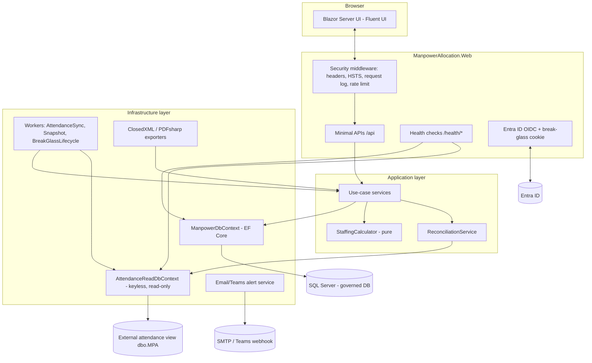
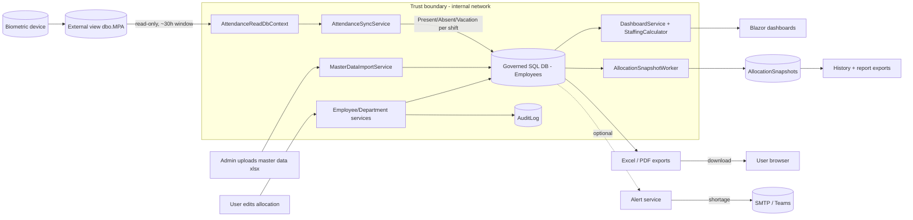

# Manpower Allocation — System Documentation (Stage B3)

Generated from the codebase on branch `claude/techsource-internal-app-setup-2zm35u`.
Covers the nine Stage-B3 deliverables. Where a section depends on Stage B2 (test
execution), the current status is stated honestly rather than assumed.

**Contents**
1. [System Architecture Document](#1-system-architecture-document)
2. [Data Flow Diagram](#2-data-flow-diagram)
3. [Database Schema / Data Dictionary](#3-database-schema--data-dictionary)
4. [API Reference](#4-api-reference)
5. [Security Checklist](#5-security-checklist)
6. [UAT Test Cases](#6-uat-test-cases)
7. [Deployment Runbook](#7-deployment-runbook)
8. [User Manual](#8-user-manual)
9. [Known Issues Log](#9-known-issues-log)

---

## 1. System Architecture Document

### 1.1 Purpose
An internal web application that shows live manpower allocation and attendance across three
divisions (EGL, Functional Support, BRG), sourced from a biometric attendance view, with daily
report archiving, exports, role-based administration, and a full audit trail.

### 1.2 Technology stack
| Concern | Technology |
|---|---|
| Runtime | .NET 8 (C# latest, Nullable enabled) |
| UI | Blazor Server (interactive server render) + Microsoft Fluent UI (`Microsoft.FluentUI.AspNetCore.Components`) |
| API | ASP.NET Core Minimal APIs (grouped under `/api`) |
| Persistence | EF Core 8 + SQL Server (governed DB); a separate keyless read-only context over the external attendance view |
| Auth | Entra ID / OpenID Connect (`Microsoft.Identity.Web`), authorization-code flow; audited break-glass path |
| Exports | ClosedXML (Excel), PDFsharp (PDF) |
| Validation | FluentValidation |
| Hosting | IIS reverse proxy (framework-dependent publish; .NET 8 Hosting Bundle) |

### 1.3 Solution layers (Clean Architecture, dependencies point inward)
- **ManpowerAllocation.Domain** — entities, enums, `DepartmentName` value object. No framework refs.
- **ManpowerAllocation.Application** — use-case services behind interfaces, DTOs, validators,
  abstractions (`IApplicationDbContext`, `IClock`, `IFactoryClock`, `IPresenceProvider`,
  `ICurrentUser`, `IAuditWriter`, `IAlertService`), and the pure `StaffingCalculator`.
- **ManpowerAllocation.Infrastructure** — EF Core `ManpowerDbContext` + configurations + migrations,
  implementations of the abstractions, background workers, external integrations, export generators.
- **ManpowerAllocation.Web** — Blazor pages/components, Minimal API endpoints, auth, security
  middleware, health checks, DI wiring (`Program.cs`).

### 1.4 Component diagram



### 1.5 Integrations
- **Entra ID** — sole interactive login (OIDC authorization-code flow).
- **External attendance view `[dbo].[MPA]`** — read-only; view/schema/column names are
  configuration-driven (`Attendance:*`). Maps `EmpID → Employee.BadgeNumber`.
- **SMTP / Teams webhook** — optional outbound shortage alerts (`Alerts:*`).

### 1.6 Background workers
| Worker | Cadence | Responsibility |
|---|---|---|
| `AttendanceSyncWorker` | every `Attendance:SyncIntervalMinutes` (default 10 min) | reads the biometric view, updates each non-supply employee's status per their shift window |
| `AllocationSnapshotWorker` | polls every 1 min | captures the daily report at 10:00 (day) and 22:00 (night) factory-local; self-healing back-fill; writes `SnapshotHeartbeat` |
| `BreakGlassLifecycleWorker` | periodic | enforces the break-glass auto-disable window and detects out-of-band enables |

---

## 2. Data Flow Diagram



### 2.1 What crosses the boundary
- **Inbound:** biometric punches (via `dbo.MPA`), Entra ID tokens (OIDC), admin master-data
  spreadsheets.
- **Outbound:** generated Excel/PDF files streamed to the authenticated user's browser; optional
  shortage alert emails/Teams messages. No PII is written to logs; error responses are generic.
- **Never leaves:** connection strings, the break-glass secret hash (config only), raw stack traces.

---

## 3. Database Schema / Data Dictionary

Governed database (EF Core `ManpowerDbContext`). Enums are stored as their integer values.

### 3.1 `Employees`
| Field | Type | Notes |
|---|---|---|
| Id | int (PK, identity) | Surrogate key |
| Name | nvarchar | Display name (not unique) |
| BadgeNumber | nvarchar null | Maps to biometric `EmpID`; not unique; blank for some outsource rows |
| Division | int (enum) | 1=Egl, 2=FunctionalSupport, 3=Brg |
| DepartmentId | int (FK → Departments) | |
| Shift | int (enum) | 1=Day, 2=Night |
| Status | int (enum) | 1=Present, 2=Absent, 3=OnVacation |
| IsSupply | bit | Outsource/agency worker; excluded from own headcount and from sync |
| Notes | nvarchar null | Free-text designation |
| RowVersion | rowversion | Optimistic concurrency token |

### 3.2 `Departments`
| Field | Type | Notes |
|---|---|---|
| Id | int (PK) | |
| Division | int (enum) | |
| Name | nvarchar | |
| RequiredDay | int | Day-shift requirement |
| RequiredNight | int | Night-shift requirement |
| Sequence | decimal | Display order |
| IsActive | bit | OFF departments contribute present staff but no requirement |
| RowVersion | rowversion | |

### 3.3 `RoleAssignments`
| Field | Type | Notes |
|---|---|---|
| Id | int (PK) | |
| EntraObjectId | nvarchar | Entra user object id (identity key) |
| DisplayName | nvarchar null | |
| Role | int (enum) | 1=Viewer, 2=User, 3=Admin |
| CreatedAtUtc | datetime2 | |
| CreatedByObjectId | nvarchar null | Admin who granted |

### 3.4 `AuditLogEntries` (immutable)
| Field | Type | Notes |
|---|---|---|
| Id | bigint (PK) | |
| UserId | nvarchar | Entra object id, or actor name (e.g. `attendance-sync`) |
| UserDisplayName | nvarchar null | |
| TimestampUtc | datetime2 | |
| Action | int (enum) | 1=Create, 2=Update, 3=Delete, 4=SignIn, 5=SignOut |
| EntityName | nvarchar | e.g. Employee, Department, AttendanceSync |
| RecordId | nvarchar null | Affected record key |
| OldValue | nvarchar(max) null | JSON before-image |
| NewValue | nvarchar(max) null | JSON after-image |
| IsBreakGlassSession | bit | True when the actor used the emergency path |

### 3.5 `BreakGlassAccounts` (single row)
| Field | Type | Notes |
|---|---|---|
| Id | int (PK) | |
| UserName | nvarchar | Default `breakglass` |
| IsEnabled | bit | Disabled by default |
| EnabledAtUtc / DisabledAtUtc / LastLoginAtUtc | datetime2 null | Lifecycle timestamps |
| EnableReason | nvarchar null | Required justification when enabled |
| RowVersion | rowversion | |

### 3.6 `ShiftSettings` (single row, Id=1)
| Field | Type | Notes |
|---|---|---|
| Id | int (PK) | Always 1 |
| DayShiftStart | time | Default 07:00 |
| NightShiftStart | time | Default 19:00 |
| UpdatedAtUtc | datetime2 | |
| UpdatedByObjectId | nvarchar null | |

### 3.7 `AllocationSnapshots` + detail tables
- **AllocationSnapshots** — header per operational date + shift: `Id (bigint PK)`, `OperationalDate`,
  `Shift`, `CapturedAtUtc`, `Source`, and rollups `OnRoll, Present, Absent, OnVacation, SupplyPresent,
  TotalPresent, Required, Variance, ShortageDepartmentCount`.
- **AllocationSnapshotDepartments** — per-department rows (FK `SnapshotId`, cascade delete):
  department id/name, division, `IsActive`, `Required, OnRoll, Present, Absent, OnVacation,
  SupplyPresent, TotalPresent, Variance, Status`.
- **AllocationSnapshotEmployees** — per-employee lines (FK `SnapshotId`, cascade delete):
  employee id, name, badge, division, department name, shift, status, `IsSupply`.

### 3.8 External (read-only, not migrated) — `[dbo].[MPA]`
Keyless view mapped by `AttendanceReadDbContext`; columns configurable: `EmpID` (→ badge),
`InTime`, `OutTime`, `ShiftLabel`.

### 3.9 Relationships
`Department 1—* Employee` · `AllocationSnapshot 1—* AllocationSnapshotDepartment` ·
`AllocationSnapshot 1—* AllocationSnapshotEmployee` · unique index on
`AllocationSnapshots(OperationalDate, Shift)`.

---

## 4. API Reference

All endpoints are under `/api`, inherit the **deny-by-default** auth fallback, rate limiting
(120 req/min per principal), and return generic ProblemDetails on error. Roles are hierarchical
(Admin ⊇ User ⊇ Viewer). Requests/responses are JSON unless noted.

### 4.1 Dashboard — Viewer
| Method | Path | Query | Returns |
|---|---|---|---|
| GET | `/api/dashboard/summary` | `shift` (All/Day/Night) | Factory summary (per-division totals + factory total) |
| GET | `/api/dashboard/division/{division}` | `shift` | Division dashboard (per-department stats) |

### 4.2 Departments
| Method | Path | Role | Body |
|---|---|---|---|
| GET | `/api/departments?division=` | Viewer | — |
| POST | `/api/departments` | Admin | CreateDepartmentRequest |
| PUT | `/api/departments/{id}` | Admin | UpdateDepartmentRequest |
| PUT | `/api/departments/{id}/active` | User | SetActiveRequest |
| DELETE | `/api/departments/{id}` | Admin | — |

### 4.3 Employees
| Method | Path | Role | Body |
|---|---|---|---|
| GET | `/api/employees?division=` | Viewer | — |
| GET | `/api/employees/search?term=` | Viewer | — |
| POST | `/api/employees` | User | CreateEmployeeRequest |
| PUT | `/api/employees/{id}` | User | UpdateEmployeeRequest |
| PUT | `/api/employees/{id}/status` | User | ChangeStatusRequest |
| PUT | `/api/employees/{id}/shift` | User | ChangeShiftRequest |
| PUT | `/api/employees/{id}/move` | User | MoveEmployeeRequest |
| DELETE | `/api/employees/{id}` | Admin | — |

### 4.4 Admin — Admin only
| Method | Path | Purpose |
|---|---|---|
| GET | `/api/admin/break-glass/status` | Break-glass state |
| GET | `/api/admin/audit?take=&breakGlassOnly=` | Audit trail read |
| POST | `/api/admin/attendance/sync` | Trigger a manual sync |
| GET | `/api/admin/attendance/status` | Last sync result |
| GET/PUT | `/api/admin/shift-settings` | Read/update shift start times |
| GET | `/api/admin/roles` · PUT `/api/admin/roles` · DELETE `/api/admin/roles/{id}` | Role assignments |
| POST | `/api/admin/import/attendance` (multipart: `file`, `replaceExisting`) | Master data / attendance import |
| POST | `/api/admin/import/requirements` (multipart: `file`) | Requirements import |

### 4.5 Exports — Viewer (reconciliation is Admin)
| Method | Path | Notes |
|---|---|---|
| GET | `/api/exports/requirements-template` | Editable requirements xlsx |
| GET | `/api/exports/report` | Staffing report xlsx (per-shift rows) |
| GET | `/api/exports/attendance` | Attendance list xlsx |
| GET | `/api/exports/history?from=&to=&format=csv\|pdf` | Archived history (Excel default) |
| GET | `/api/exports/snapshot?id=&format=pdf\|xlsx` | Single daily report |
| GET | `/api/exports/reconciliation` | **Admin** — biometric reconciliation workbook |

### 4.6 Auth
| Method | Path | Notes |
|---|---|---|
| POST | `/auth/break-glass` | Emergency login; strict rate limit (5 / 5 min) |
| POST | `/auth/logout` | Sign out (audited) |
| (OIDC) | `/MicrosoftIdentity/Account/SignIn` etc. | Entra ID sign-in UI |

### 4.7 Health — anonymous
| Method | Path | Checks |
|---|---|---|
| GET | `/health/live` | Process liveness only |
| GET | `/health/ready` | DB reachable + attendance feed + snapshot worker; compact JSON |

**Unauthenticated access to any `/api/*` endpoint returns 401/redirect** via the deny-by-default
fallback policy (health endpoints are the only anonymous surface).

---

## 5. Security Checklist

| # | Control | Status | Where |
|---|---|---|---|
| 1 | SSO-only login (Entra ID, OIDC auth-code flow, tokens off front channel) | ✅ | `Program.cs` |
| 2 | Deny-by-default authorization fallback (auth required on every route) | ✅ | `AuthorizationPolicies` |
| 3 | Hierarchical role policies (Viewer/User/Admin) from role-assignment table via claims transformation | ✅ | `AppRoleClaimsTransformation`, `AuthorizationPolicies` |
| 4 | Default Viewer provisioned on first login; no auto-downgrade | ✅ | `OnTokenValidated` → `RoleService.EnsureDefaultViewerAsync` |
| 5 | Server-side role enforcement on pages **and** endpoints | ✅ | `[Authorize(Policy=…)]` + `RequireAuthorization` |
| 6 | Break-glass disabled by default; time-boxed auto-disable; enforced on live sessions | ✅ | `BreakGlassService`, `OnValidatePrincipal`, `BreakGlassLifecycleWorker` |
| 7 | Break-glass secret stored as a PBKDF2 hash **outside the database** (app-set protected file, or configuration fallback); never in the DB | ✅ | `IBreakGlassSecretStore` / `FileBreakGlassSecretStore`, `BreakGlassSecretHasher` |
| 8 | Break-glass sessions flagged in the audit trail | ✅ | `AuditLogEntry.IsBreakGlassSession` |
| 9 | HSTS (preload) + HTTPS redirect | ✅ | `Program.cs` |
| 10 | Security headers on every response | ✅ | `SecurityHeadersMiddleware` |
| 11 | Hardened cookie: `__Host-` prefix, HttpOnly, Secure, SameSite=Lax, Path=/ | ✅ (Lax deviation documented) | `Program.cs` |
| 12 | Rate limiting on API; stricter bucket on break-glass login | ✅ | `Program.cs` (120/min; 5/5min) |
| 13 | Data Protection keys persisted (survive app-pool recycles) | ✅ (set `DataProtection:KeyPath`) | `Program.cs` |
| 14 | Forwarded headers honoured behind IIS | ✅ | `Program.cs` |
| 15 | Generic error responses; real cause logged PII-free | ✅ | `GlobalExceptionHandler`, `RequestLoggingMiddleware` |
| 16 | Parameterized queries only (EF Core; no raw SQL) | ✅ | throughout |
| 17 | Immutable audit trail with old/new JSON values | ✅ | `AuditWriter`, `AuditLogEntry` |
| 18 | External attendance source read-only, never written/migrated | ✅ | `AttendanceReadDbContext` |
| 19 | Optimistic concurrency on shared-edit entities | ✅ | `RowVersion` tokens |

---

## 6. UAT Test Cases

> **Status:** Stage B2 executed. **22 automated tests pass in CI** (workflow `CI`, commit
> `294158e` — `Failed: 0, Passed: 22`). Rows below are marked **Automated ✅** where an
> automated test covers the rule; the remainder are **Manual** — they require a live host + real
> Entra ID (role gating, unauthenticated 401) or DB-enforced concurrency, which cannot run
> headless, and are pending business-owner UAT on a deployed environment. No results are fabricated.

| ID | Category | Scenario | Expected result | Result |
|---|---|---|---|---|
| F-01 | Functional | View factory summary | Summary loads for the live shift; per-division present/required shown | Automated ✅ (live-shift + division roll-up); UI render Manual |
| F-02 | Functional | Edit employee status | Status persists; audit Update row with old/new value | Manual — pending |
| F-03 | Functional | Attendance sync updates presence | Punched employees → Present | **Automated ✅** |
| F-04 | Functional | Daily report capture | Snapshot exists for date+shift; visible in History | Manual — pending |
| F-05 | Functional | Staffing report per-shift | Day and Night measured separately; absence not pooled | **Automated ✅** (calculator) |
| E-01 | Edge | Invalid input | 400 generic validation error; nothing saved | Manual — pending |
| E-02 | Edge | Malformed import file | Rejected gracefully; no partial write | Manual — pending |
| E-03 | Edge | Concurrent edit | Second save reload+retry; no lost update | Manual (InMemory cannot enforce RowVersion) |
| E-04 | Edge | Dependency unavailable | App serves last-known state; sync reports failure | **Automated ✅** (no-op path); health Degraded Manual |
| E-05 | Edge | Unconfigured attendance source | Sync no-ops; nobody wrongly marked absent | **Automated ✅** |
| S-01 | Security | Viewer restrictions | Denied (UI hidden + endpoint 403) | Manual — pending |
| S-02 | Security | User vs Admin | 403 on Admin-only DELETE | Manual — pending |
| S-03 | Security | Unauthenticated API | 401/redirect | Manual — pending |
| S-04 | Security | Audit accuracy | Audit rows with correct action + old/new JSON | Manual — pending |
| S-05 | Security | Break-glass default off | Disabled by default; **enable is DB-only (no GUI/API)**; secret hash in config only; use flagged in audit | Manual — pending |

**Automated test breakdown (22 total, all passing):** StaffingCalculator (6) — per-shift vs pooled
absence, OFF/Short/Excess, roll-up; AttendanceSyncService (7) — presence rule, vacation preserved,
blank badge / supply untouched, cumulative previous-shift, unconfigured no-op; ReconciliationService
(4) — matched/unmatched, no-badge list, status balance, unconfigured; DashboardService (5) —
live-shift resolution (4 cases) + per-shift division roll-up.

---

## 7. Deployment Runbook

### 7.1 Prerequisites
- Windows Server + IIS with the **.NET 8 Hosting Bundle** installed.
- SQL Server reachable; a database for the app; read access to the attendance view `[dbo].[MPA]`.
- An Entra ID app registration (client id/secret, redirect URI `https://<host>/signin-oidc`).

### 7.2 Build artifact
- Trigger the **Publish (IIS package)** GitHub Actions workflow → download the
  `manpowerallocation-iis` zip (framework-dependent publish).

### 7.3 Configure (`appsettings.Production.json` or environment / user-secrets)
```
ConnectionStrings:ManpowerDatabase   = <governed DB>
ConnectionStrings:AttendanceDatabase = <attendance DB>   (optional; omit to disable sync safely)
AzureAd:Instance/TenantId/ClientId/ClientSecret/CallbackPath
DataProtection:KeyPath               = <folder writable by the app-pool identity>
Attendance:Enabled / SyncIntervalMinutes / TimeZoneId / ViewSchema / ViewName /
           EmployeeIdColumn / InTimeColumn / OutTimeColumn / ShiftLabelColumn / CurrentShiftValue
BreakGlass:SecretStorePath           = <writable folder/file for the app-set secret hash; default App_Data>
BreakGlass:AutoDisableAfterHours / ItHeadEmail  (+ optional SecretHashBase64/SaltBase64/Iterations fallback)
Alerts:<SMTP/Teams settings>   (optional)
```

### 7.4 Deploy
1. Stop the IIS site/app-pool.
2. Copy the unzipped package to the site folder.
3. Ensure the app-pool identity can read/write `DataProtection:KeyPath`.
4. Start the app-pool. On startup the app **applies EF migrations** and **seeds** the singleton
   break-glass (disabled) and shift-settings rows.
5. Verify `GET /health/ready` returns Healthy; sign in via Entra ID.

### 7.5 Enable / disable break-glass (emergency access)

The emergency account has **two independent gates**, neither of which is a GUI action. The
`/admin/break-glass` screen is **read-only status** — it cannot enable the account by design.

**One-time setup — set the secret in the app (Admin, audited):**
An administrator opens **Admin → Break-glass Status** and uses **Set / rotate emergency secret**:
enter a strong secret (≥ 12 chars), confirm, save. The app derives a PBKDF2/SHA-256 hash and stores
it **outside the database** — in a protected file on the server (`BreakGlass:SecretStorePath`, default
`App_Data/break-glass-secret.json`). The plain secret is never stored; the change is audited. Keep the
plain secret in your team password vault (it is what you type at login). Rotating simply overwrites it.

The app-pool identity must be able to read/write `BreakGlass:SecretStorePath`.

*Optional fallback:* a hash can still be supplied through the `BreakGlass` configuration section
(`SecretHashBase64` / `SaltBase64` / `Iterations`, e.g. via Key Vault); it is used only when no
app-set file exists. Configuration values can be generated offline with the same parameters
(PBKDF2 / SHA-256 / 210,000 iterations / 32-byte key).

**Enable (emergency) — manual DB change:**
```sql
UPDATE dbo.BreakGlassAccounts
SET    IsEnabled = 1, EnableReason = 'Entra ID outage - <reason>', EnabledAtUtc = NULL
WHERE  UserName = 'breakglass';
```
Leaving `EnabledAtUtc` NULL lets the app stamp it and start the four-hour countdown on first use.
Then browse to **`/break-glass`** and sign in with the username + secret. The lifecycle worker
alerts the IT Head, and every action is flagged in the audit trail (`IsBreakGlassSession = true`).

**Disable:** auto-disables four hours after activation (enforced at login and by
`BreakGlassLifecycleWorker`). To end early:
```sql
UPDATE dbo.BreakGlassAccounts SET IsEnabled = 0, DisabledAtUtc = SYSUTCDATETIME(), EnabledAtUtc = NULL WHERE UserName = 'breakglass';
```
It is **disabled by default** after any deployment (the seed row is created disabled).

### 7.6 Rollback
- Re-deploy the previous package. Migrations are additive; coordinate any schema rollback with DBA.

---

## 8. User Manual

### 8.1 Signing in
Open the app URL and sign in with your corporate account (Entra ID). First-time users get
**Viewer** access automatically. `[SCREENSHOT: Entra sign-in]`

### 8.2 Summary (Home)
Shows present-vs-required across the three divisions **for the shift currently running**. Use the
**All / Day / Night** toggle to change scope. Absent/Vacation/Outsource are shown per division.
`[SCREENSHOT: Factory Summary]`

> Tip: "All" combines day + night over 24h, so its Absent count includes the shift that isn't on
> the floor. For shift-accurate absence, pick **Day** or **Night**.

### 8.3 Division view
Click a division to see department cards (present/required, status, absentees), toggle departments
ON/OFF (User+), expand a department to see its roster, and edit people (User+). `[SCREENSHOT: Division view]`

### 8.4 Employees
Search by name or badge; add/edit people; change status, shift, or department. `[SCREENSHOT: Employees]`

### 8.5 Report History
Browse archived daily reports (captured at 10:00 and 22:00) and export a single report as PDF or
Excel, or a date range as Excel/CSV/PDF. `[SCREENSHOT: History]`

### 8.6 Administration (Admin)
- **Attendance Sync** — run a manual sync and review the **verification panel**: what the biometric
  machine pulled, and the plain-language reconciliation (Counted / Not counted / Can't be seen).
  `[SCREENSHOT: Attendance Sync + verification]`
- **Master Data Import** — upload the requirements/attendance spreadsheet.
- **Role Assignments** — grant Viewer/User/Admin.
- **Shift Settings** — set day/night start times.
- **Break-glass Status** — set the one-time emergency secret (Set / rotate); view status. Enabling
  the account for use remains a deliberate database action by IT/DBA, not a screen action.
- **Audit Trail** — review who changed what.
`[SCREENSHOT: Admin menu]`

---

## 9. Known Issues Log

| # | Item | Impact | Workaround / Plan |
|---|---|---|---|
| 1 | Automated test coverage is domain/application only | UI, validation, import, and role-gating are not yet automated (covered by manual UAT) | Added xUnit project (22 tests, CI-gated); extend with WebApplicationFactory integration tests for auth/role gating |
| 2 | ~~Temporary PDF diagnostics in `ExportEndpoints`~~ | Resolved | **Removed** — PDF export confirmed working; failures now return the generic handler response |
| 3 | **Off-shift attendance depends on the external view exposing "Previous Shift" rows** | If `dbo.MPA` only returns current-shift punches, off-shift workers can be marked absent at source | Reporting is now per-shift (mitigates report inflation); confirm the view returns previous-shift rows for full accuracy |
| 4 | **Unmatched biometric IDs / roster gaps** (~83 seen) | People punch who aren't in the roster; not counted | Use the reconciliation report to add them or fix badge numbers (data task) |
| 5 | **Authoring environment cannot build .NET** | Local `dotnet build` unavailable; verification is via GitHub Actions CI | CI (build) + Publish workflows are the compile/verify gate |
| 6 | **SameSite=Lax cookie** (deviation from Strict) | Required for interactive Entra SSO return | Documented and intentional; flagged to IT |
| 7 | **"All" shift view pools day+night** | If explicitly selected, Absent includes the off-shift | Dashboards default to the live shift; a caption explains "All"; per-shift Day/Night are accurate |
